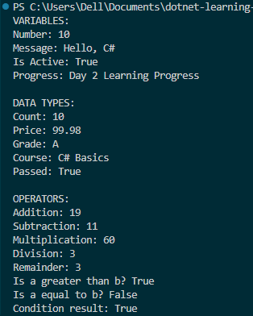

# Day 2 Progress

## Topics Covered
- C# Basics
  - Variables
  - Data Types
  - Operators
- Wrote small console program

## Tasks Completed
- Declared and initialized variables(Explict & Implicit type)
- Practiced different C# data types
- Used arithmetic, comparison, and logical operators

## Output Screenshot

### Day 2 Console Programs
