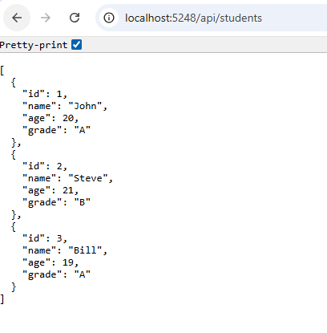
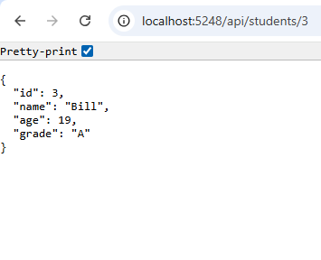

# Day 15 Progress

## Topics Covered
- REST Principles
  - REST Constraints: 
    - Client-Server, 
    - Stateless, 
    - Cacheable, 
    - Uniform Interface, 
    - Layered System, 
    - Code on Demand
  - HTTP Methods
  - HTTP Status Codes
  - URI Design

- Web API

## Tasks Completed
- **Created `StudentAPI` Web API project via CLI:**
    `dotnet new webapi --use-controllers -n StudentAPI`
   - Deleted default template `WeatherForecast.cs` and `WeatherForecastController.cs`
   - Explored Project structure
- **Created `Models/Student.cs` with Data Annotations**
- **Created `Controllers/StudentsController.cs` with 3 endpoints**
  - `GET /api/students` — returns all students as JSON
  - `GET /api/students/{id}` — returns one student or 404
  - `POST /api/students` — adds student, returns 201 Created

## Output Screenshots

  

  