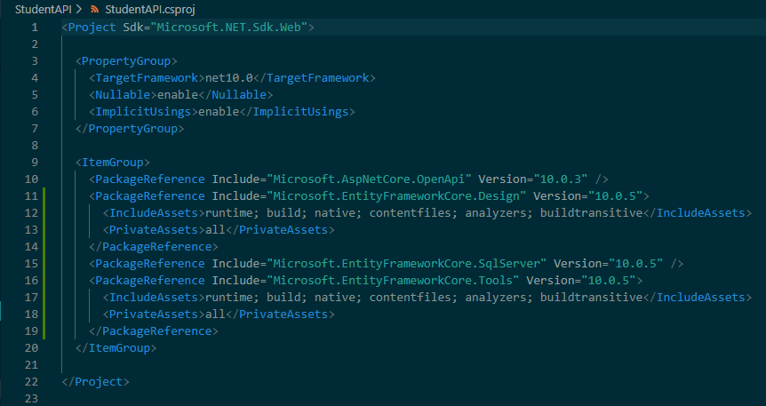
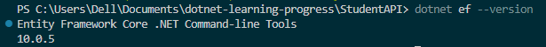

# Day 16 Progress

## Topics Covered
- Entity Framework Core
  - EF Core overview
  - Code-First and Database-First approach
  - EF Core Architecture
  - Entity classes and conventions
  - Database Providers
- EF Packages

## Tasks Completed
- **Installed EF Core packages in `StudentAPI`:**
  - `dotnet add package Microsoft.EntityFrameworkCore.SqlServer`
  - `dotnet add package Microsoft.EntityFrameworkCore.Tools`
  - `dotnet add package Microsoft.EntityFrameworkCore.Design`
  - Verified all 3 packages appear in `.csproj`

  

- **Installed `dotnet-ef` global CLI tool:**
  - `dotnet tool install --global dotnet-ef`
  - `dotnet ef --version` to confirm installation

  