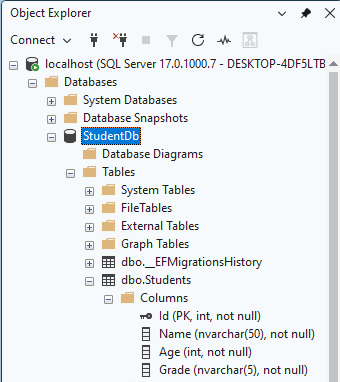

# Day 17 Progress

## Topics Covered
- SQL Server Connection
  - Connection string
- DbContext
- EF Core Migrations

## Tasks Completed
- **Added connection string to `appsettings.json` and registered in `Program.cs`**
  - Connection string points to `localhost` with database name `StudentDb`
  - `AddDbContext<AppDbContext>()` registered in DI container with `UseSqlServer()`

- **Created `Data/AppDbContext.cs`**
  - Defined `AppDbContext` inheriting `DbContext`
  - Added `DbSet<Student> Students` mapping to Students table

- **Ran migrations and verified database created in SSMS**
  - `dotnet ef migrations add InitialCreate`
  - `dotnet ef database update`
  - Verified in SSMS - `StudentDb` visible with `Students` table and correct columns

  