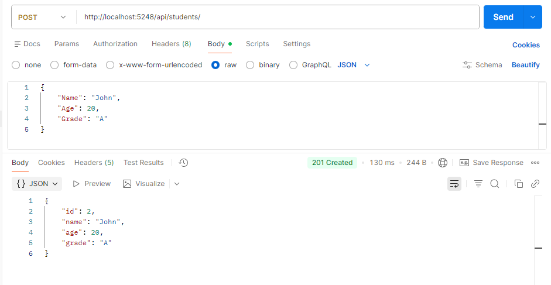
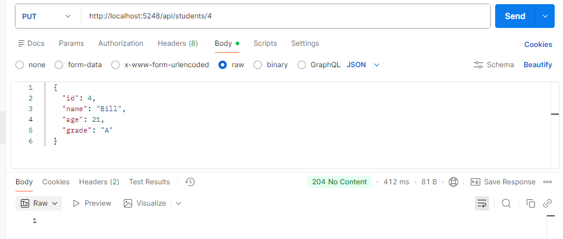
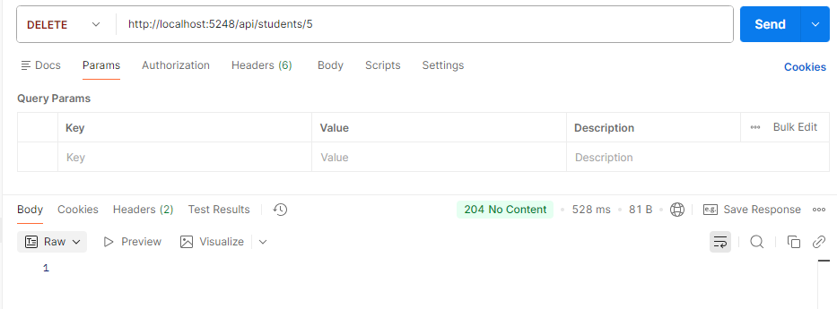
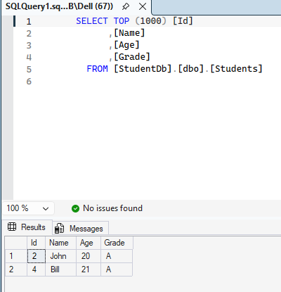

# Day 18 Progress

## Topics Covered
- EF Core CRUD Concepts
- CRUD Operations
  - `GET /api/students` 
  - `GET /api/students/{id}`
  - `POST /api/students`
  - `PUT /api/students/{id}` 
  - `DELETE /api/students/{id}`

## Tasks Completed
- **Replaced static list with `AppDbContext` in `StudentsController`**
  - Removed `static List<Student>`
  - Injected `AppDbContext` via constructor
  - All CRUD endpoints connected to real SQL Server database
- **Tested endpoints in browser**
- **Tested POST, PUT, DELETE in Postman**

## Output Screenshots

  

  

  

  