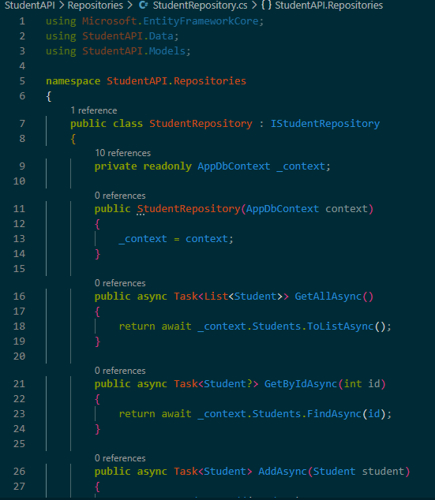

# Day 19 Progress

## Topics Covered
- Service Layer
- Repository Pattern
    - SOLID principles
    - Non-Generic Repository Pattern
    - Generic Repository Pattern
    - Unit of Work Pattern

## Tasks Completed
- **Created `Repositories/IStudentRepository.cs` and `StudentRepository.cs`**
  - Defined interface with 5 async methods: `GetAllAsync`, `GetByIdAsync`, `CreateAsync`, `UpdateAsync`, `DeleteAsync`
  - Moved all EF Core logic from controller to repository

  

- **Registered `IStudentRepository` in `Program.cs`:**
  - `builder.Services.AddScoped<IStudentRepository, StudentRepository>()`

- **Updated `StudentsController` to inject `IStudentRepository`**
  - Removed `AppDbContext` dependency from controller
  - Controller now only calls repository methods and returns HTTP responses
  - Verified all endpoints still work correctly
