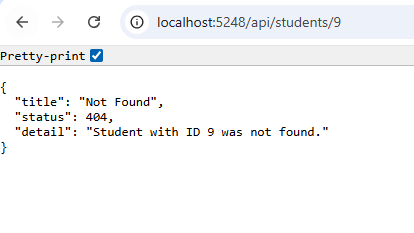

# Day 20 Progress

## Topics Covered
- Global Exception Handling
- IExceptionHandler
- Exception Filters
- Custom Exception Classes
  - `NotFoundException` - 404 Not Found
  - `BadRequestException` - 400 Bad Request
  - All other unhandled exceptions - 500 Internal Server Error with generic message
- Standard JSON error format - `type`, `title`, `status`, `detail`, `traceId`

## Tasks Completed
- **Created `Exceptions/` folder with custom exception classes and global handler**
  - `NotFoundException.cs` - thrown by repository when student not found
  - `BadRequestException.cs` - thrown for invalid business logic
  - `GlobalExceptionHandler.cs` - implements `IExceptionHandler`, maps exceptions to `ProblemDetails`

- **Updated `StudentRepository` to throw custom exceptions**
  - `GetByIdAsync`, `UpdateAsync`, `DeleteAsync` throw `NotFoundException` instead of returning null/false

- **Updated `Program.cs` - registered global exception handler**
  - Added `AddExceptionHandler<GlobalExceptionHandler>()`, `AddProblemDetails()`, `app.UseExceptionHandler()`

  