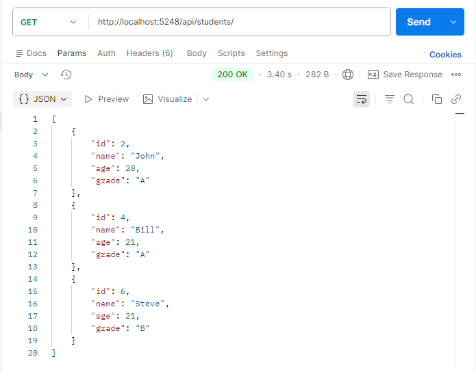
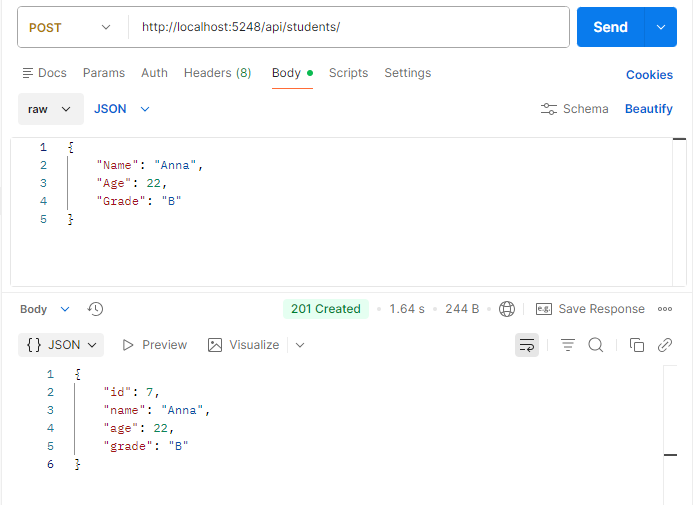
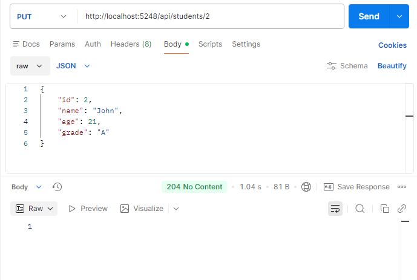
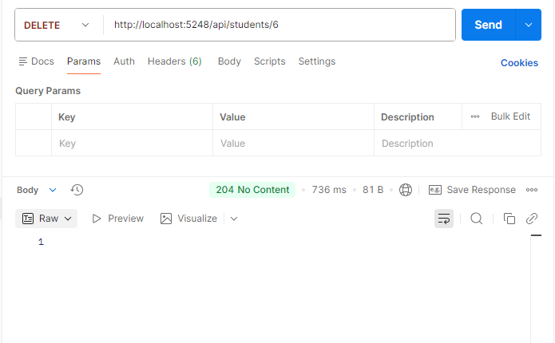
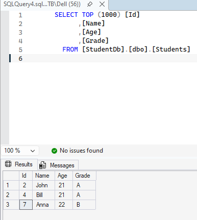
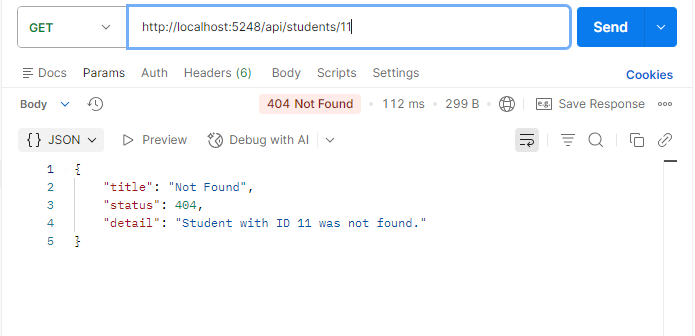

# Day 21 Progress (Week 3 Assessment)

**IMPLEMENTING CRUD API**

## Tasks Completed
- **Tested `GET /api/students` - all students**
  - Returns 200 OK + JSON array of all students

  

- **Tested `POST /api/students` - create student**
  - Returns 201 Created + new student with DB-assigned Id

  

- **Tested `PUT /api/students/2` - update student**
  - Returns 204 No Content

  

- **Tested `DELETE /api/students/6` - delete student**
  - Returns 204 No Content
  - Verified in SSMS - 1 row edited and another row removed from Students table

  

  

- **Tested error scenarios - Global Exception Handling**
  - `GET /api/students/11` - 404 + ProblemDetails JSON

  
