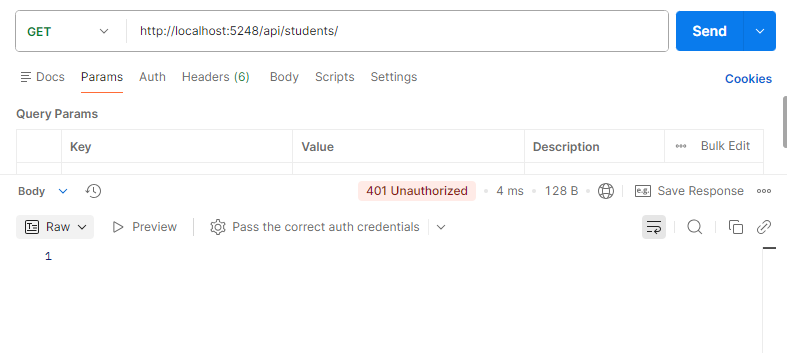
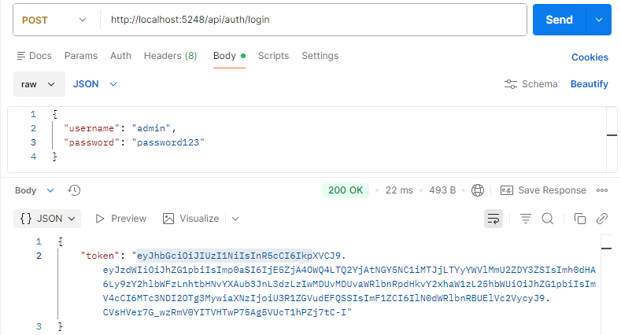
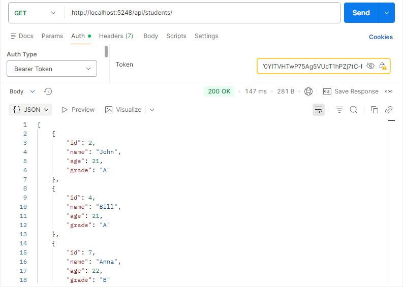
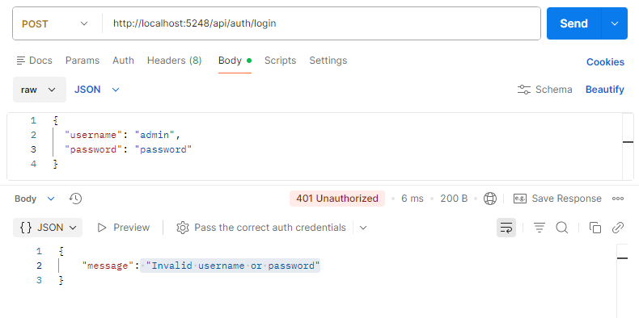

# Day 22 Progress

## Topics Covered
- Authentication and Authorization
- `app.UseAuthentication()`
- `app.UseAuthorization()`
- JWT
  - Uses
  - Features
- JWT Structure
  - `Header.Payload.Signature` (Base64 encoded, dot-separated)
  - Header 
  - Payload 
  - Signature
- JWT Claims
- JWT Flow
- Implementation

## Tasks Completed
- **Installed `Microsoft.AspNetCore.Authentication.JwtBearer` package:**
  - `dotnet add package Microsoft.AspNetCore.Authentication.JwtBearer`

- **Added JWT config to `appsettings.json` and updated `Program.cs`**
  - Added `Jwt` section with Key, Issuer, Audience, ExpiryMinutes
  - Registered `AddAuthentication().AddJwtBearer()` with `TokenValidationParameters`
  - Added `app.UseAuthentication()` before `app.UseAuthorization()`

- **Created `Models/LoginRequest.cs` and `Controllers/AuthController.cs`**
  - `[AllowAnonymous]` login endpoint at `POST /api/auth/login`
  - Hardcoded credentials for demo - returns JWT on valid login

- **Added `[Authorize]` to `StudentsController`**
  - All CRUD endpoints now require a valid JWT

- **Tested JWT in Postman**
  - `GET /api/students` without token - 401 Unauthorized
  - `POST /api/auth/login` - 200 OK + JWT token
  - `GET /api/students` with `Authorization: Bearer token` 200 OK + student Details
  - `POST /api/auth/login` with wrong credentials - 401 Unauthorized

  

  

  

  