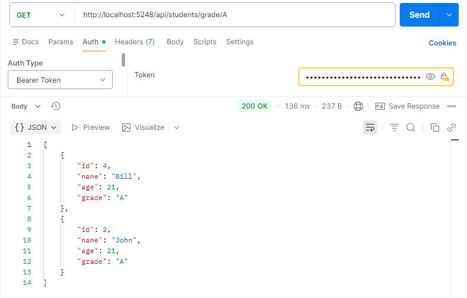
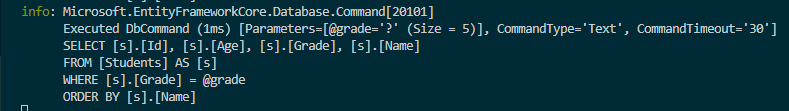

# Day 23 Progress

## Topics Covered
- LINQ Fundamentals
  - Three Parts of a Query Operation
  - Query Syntax and Method Syntax
  - `IEnumerable<T>` and `IQueryable<T>` - in-memory and database-side filtering
  - Deferred Execution
  - Immediate Execution - `Count`, `Sum`, `Any`, `ToList`, `First` 
- Filtering & Projection
  - `Where(predicate)` 
  - `Select(selector)` 
- Ordering
  - `OrderBy` / `OrderByDescending` 
  - `ThenBy` / `ThenByDescending`
- Aggregate Operators
  - `Count`, `Sum`, `Average`, `Min`, `Max` 
- GroupBy
  - `GroupBy(key)` - returns `IGrouping<TKey, T>`
- Element Operators
  - `First` / `FirstOrDefault` 
  - `Single` / `SingleOrDefault`
- Quantifiers
  - `Any(predicate)`
  - `All(predicate)` 
  - `Contains` 
- Joins - `Join()` 
- Paging - `Skip((page-1) * size).Take(size)` - SQL `OFFSET/FETCH`
- LINQ in EF Core - `IQueryable<T>` from `DbSet` translates LINQ to SQL automatically

## Tasks Completed
- **Added `GetByGradeAsync(string grade)` repository method to `StudentAPI` using LINQ + EF Core**
  - filter by grade + order by name
  - Tested new endpoint in Postman

  

- **Verified SQL generated correctly via EF Core console logging**

  