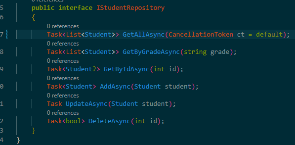
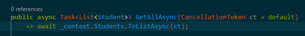
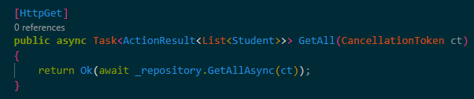

# Day 24 Progress

## Topics Covered
- Synchronous vs Asynchronous
- Async in APIs 
- Task & Task<T> 
- `async` keyword 
- `await` keyword 
- State Machine 
- I/O-bound vs CPU-bound  
- `ConfigureAwait(false)` 
- `Task.WhenAll` 
- `Task.WhenAny` 
- `CancellationToken`
- Deadlocks

## Tasks Completed
- **Verified all StudentAPI repository methods are correctly async**
  - All CRUD methods use await + EF Core Async methods 
  - All controller actions are async Task<IActionResult> - async all the way

- **Added CancellationToken to GetAll endpoint**
  - Updated IStudentRepository, StudentRepository, StudentsController
  - ASP.NET Core automatically cancels token if client disconnects

  

  

  