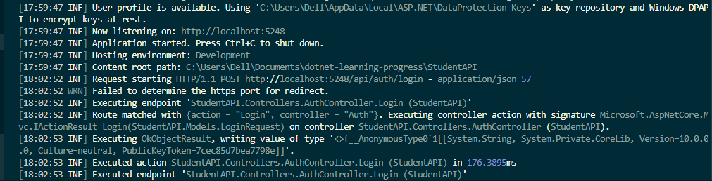

# Day 25 Progress

## Topics Covered
- Logging
- Built-in ILogger<T> and 6 log levels (Trace/Debug/Info/Warning/Error/Critical)
- Serilog
- Installing packages - Serilog.AspNetCore, Serilog.Sinks.File etc.
- Two-stage initialization.
- `appsettings.json` Serilog section
- Sinks
- Enrichers
- Message templates
- `UseSerilogRequestLogging()`

## Tasks Completed
- **Installed Serilog packages in StudentAPI**
  - `dotnet add package Serilog.AspNetCore` 
  - `dotnet add package Serilog.Sinks.File`

- **Configured Serilog in Program.cs**
  - Replaced default logging with Serilog using UseSerilog()
  - Enabled console logging for real-time monitoring and file logging with daily rolling logs (logs studentapi-.log)

- **Verified structured request logging output**
  - logs/ folder created with rolling log file

  
