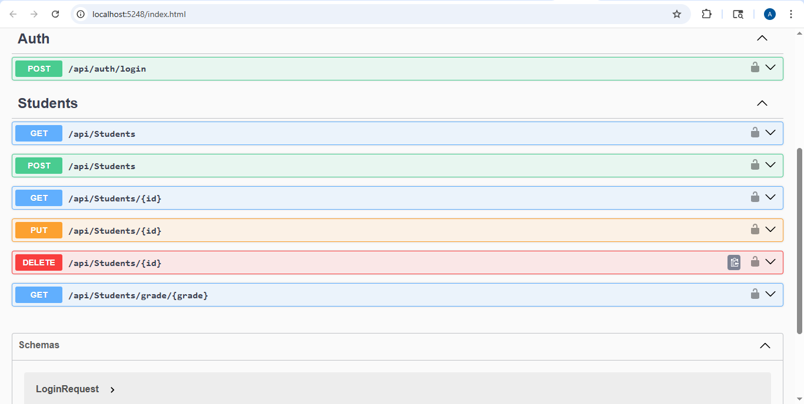
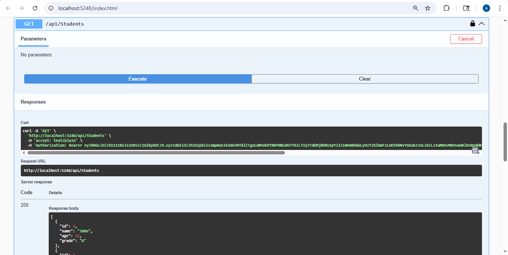

# Day 26 Progress

## Topics Covered
- OpenAPI vs Swagger vs Swashbuckle
- Swagger Uses
- Built-in .NET 9 OpenAPI (AddOpenApi + MapOpenApi)
- Swashbuckle - full interactive browser UI + JWT 
- Installing `Swashbuckle.AspNetCore`
- Program.cs setup:
  - `AddSwaggerGen()` with `OpenApiInfo` (title, version, description)
  - `AddSecurityDefinition("Bearer", ...)` - JWT Authorize button
  - `AddSecurityRequirement(...)` - applies JWT globally to all endpoints
  - `app.UseSwagger()` + `app.UseSwaggerUI()` in Development only
  - `RoutePrefix = string.Empty` - Swagger UI at root URL
- `[ProducesResponseType]`
- Testing from Swagger UI - login -> copy token -> Authorize

## Tasks Completed
- **Installed Swashbuckle.AspNetCore**
  - `dotnet add package Swashbuckle.AspNetCore`

- **Updated Program.cs with full Swagger setup**
  - AddSwaggerGen with OpenApiInfo + AddSecurityDefinition + AddSecurityRequirement
  - UseSwagger + UseSwaggerUI with RoutePrefix = string.Empty

- **Added [ProducesResponseType] to all StudentsController actions**
  - GET all: 200, 401
  - GET by id: 200, 404, 401
  - POST: 201, 400, 401
  - PUT: 204, 400, 404, 401
  - DELETE: 204, 404, 401

- **Tested full JWT flow in Swagger UI**
  - Opened http://localhost:5248 - Swagger UI loaded
  - POST /api/auth/login -> 200 OK + token
  - Authorize -> pasted token -> all protected endpoints unlocked
  - GET /api/students -> 200 OK + students array

  

  