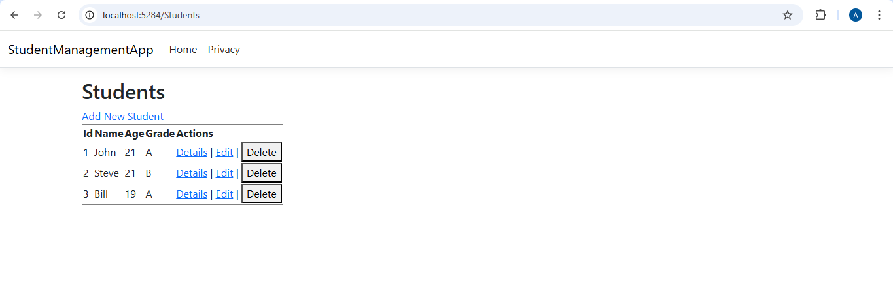
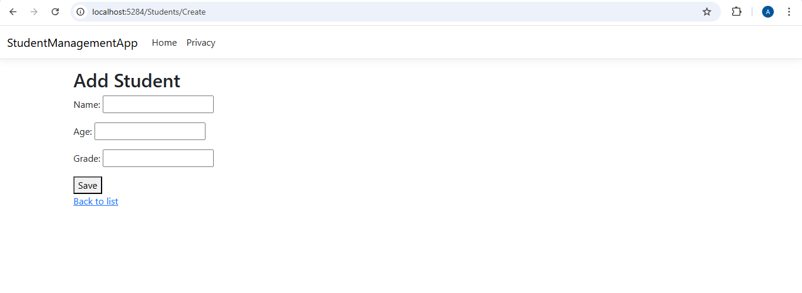
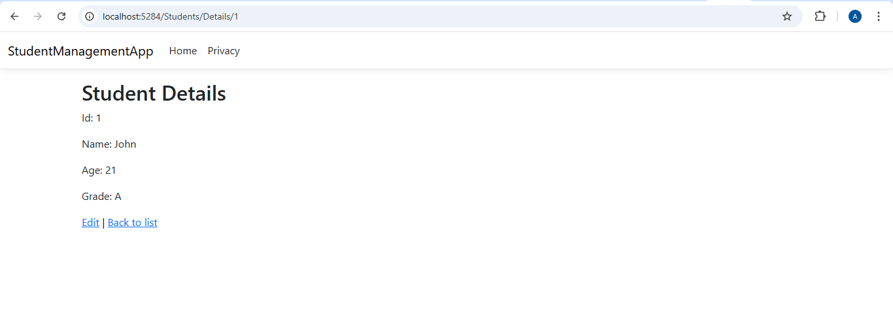
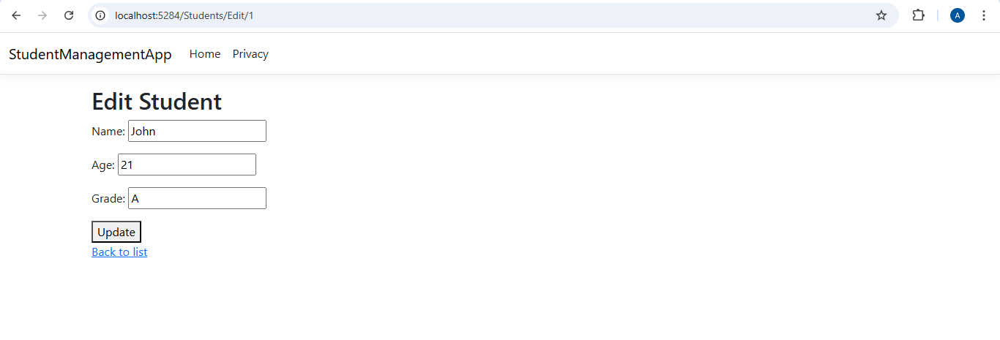

# Day 10 Progress

## Topics Covered
- Routing
  - Routing & RouteTable
  - Route Constraints

- Controllers & Actions
  - Controllers
  - Action method
  - ActionResult types
  - Action Selectors
  - ActionVerbs
  - Integrating Controller, View and Model 

## Tasks Completed
- **Created Student Model**
  - Added `Models/Student.cs` with Id, Name, Age, Grade properties

- **Tested all routes in browser**
  - Verified URLs correctly map to controller actions

- **Created StudentsController with full CRUD actions**
  - `Index` — GET /Students — lists all students using in-memory list
  - `Details` — GET /Students/Details/{id} — shows one student
  - `Create` — GET + POST /Students/Create — form to add new student
  - `Edit` — GET + POST /Students/Edit/{id} — form to update student
  - `Delete` — POST /Students/Delete/{id} — removes student

  

  

  

  