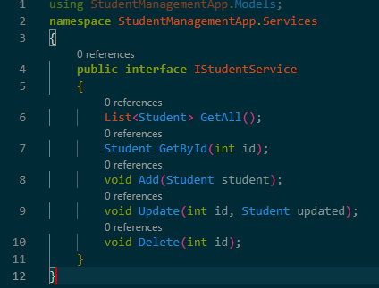
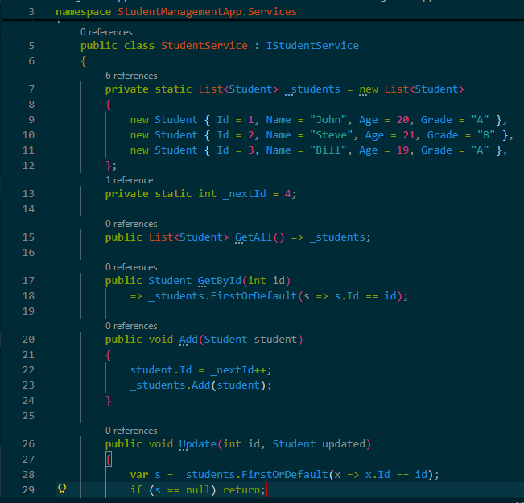

# Day 11 Progress

## Topics Covered
- Dependency Injection
  - Need of Dependency Injection
  - 3 Types of DI (Constructor, Property, Method)
  - Client / Service / Injector class roles
  - Constructor Injection, Action Method Injection, 
  - IoC Container

- Service Registration  
  - Singleton, Transient, Scoped 
  - Getting services manually via HttpContext.RequestServices (anti-pattern)

## Tasks Completed
- **Refactored StudentsController to use DI**
  - Constructor now receives IStudentService via injection
  - All actions call service methods — zero data logic in controller

- **Created IStudentService interface**
  - Defined GetAll, GetById, Add, Update, Delete methods in `Services/IStudentService.cs`

  

- **Created StudentService implementation**
  - Moved all student data logic from controller into `Services/StudentService.cs`

  

- **Registered StudentService in Program.cs**
  - Added `builder.Services.AddScoped<IStudentService, StudentService>()`

  

