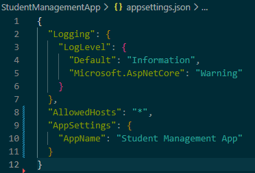
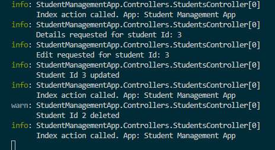

# Day 12 Progress

## Topics Covered
- Configuration
  - IConfiguration
  - `appsettings.json` structure 
  - Environment Variables
    - ASPNETCORE_ENVIRONMENT
    - Standard environments: Development, Staging, Production
 
- Logging
  - Logging architecture
  - Log Levels: Trace(0), Debug(1), Information(2), Warning(3), Error(4), Critical(5), None(6)
  - Built-in providers auto-registered by `CreateBuilder`: Console, Debug, EventSource
  - Structured logging

## Tasks Completed
- Added `AppName` key under `"AppSettings"` to demonstrate `IConfiguration` usage

  
 
- Updated `StudentsController` with `IConfiguration` and `ILogger<T>`

- **Tested logging output in terminal**
  - Navigated through student list, details, create, delete and verified structured log messages appearing in console with correct level and category name `StudentManagementApp.Controllers.StudentsController`

  