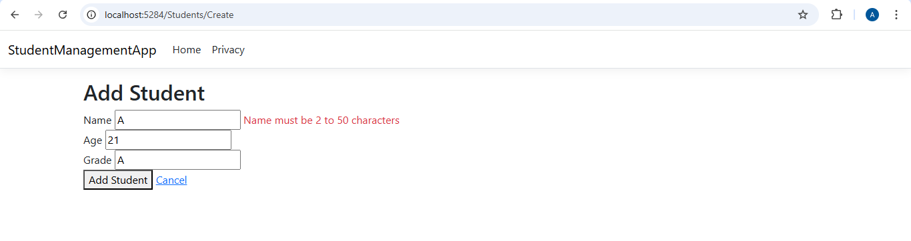
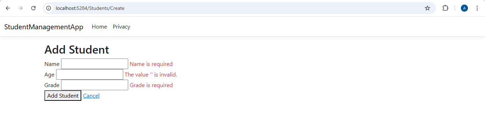

# Day 13 Progress

## Topics Covered
- Model Binding
  - Binding Sources and its priority order
  - Simple type binding - primitive params 
  - Complex type binding - form field
  - Source Attributes
  - `[Bind]` attribute to include/exclude specific properties

- Validation
  - Model Validation
  - ModelState
  - ModelState.IsValid
  - Built-in Data Annotations
  - Custom error messages via `ErrorMessage` parameter
  - Validation Tag Helpers
  - Client-side vs Server-side validation

## Tasks Completed
- **Updated `Student.cs` with Data Annotation attributes**
  - Added `[Required]` and `[StringLength(50, MinimumLength = 2)]` to `Name`
  - Added `[Range(5, 25)]` to `Age`
  - Added `[Required]` and `[StringLength(3)]` to `Grade`

- **Updated `StudentsController` — `Create` and `Edit` POST actions check `ModelState.IsValid`**
  - Returns `View(student)` on invalid state
  - Added `LogWarning` for invalid model state

- **Updated `Create.cshtml` and `Edit.cshtml` with validation tag helpers**
  - Added `asp-validation-for` span next to each input field
  - Added `asp-validation-summary="ModelOnly"` div at the top of the form
  - Verified client-side validation displays in browser before form is submitted

  
  
  