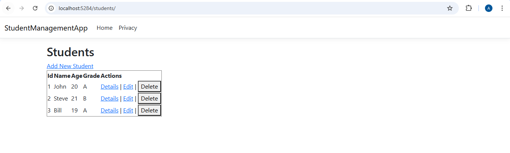
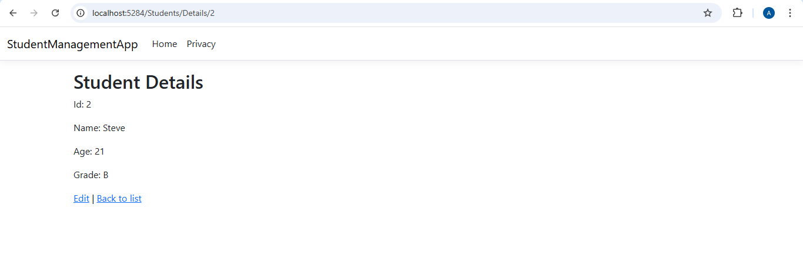
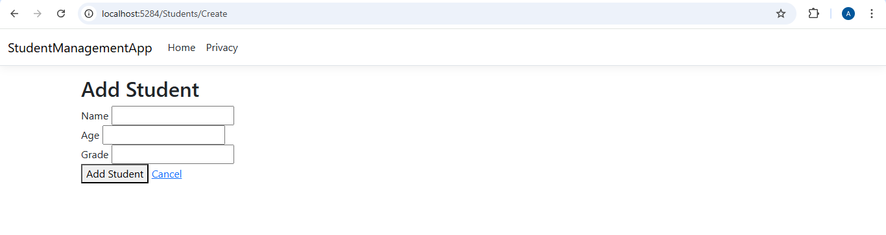

# Day 14 – Week 2 Assessment

## Tasks Completed
- Verified all endpoints built across Days 8-13 are working
- 3 core endpoints working in StudentManagementApp:
  - `GET /Students` - retrieves and displays all students
  - `GET /Students/Details/{id}` - retrieves one student by ID, returns 404 if not found
  - `POST /Students/Create` - accepts form data, validates via Data Annotations, adds student
  - `StudentManagementApp` project committed and pushed - middleware, DI, config, logging, validation all included

## Output Screenshots
- **Endpoint 1 — `GET /Students`**

  

- **Verified Endpoint 2 — `GET /Students/Details/{id}`**

  

- **Verified Endpoint 3 — `POST /Students/Create`**

  