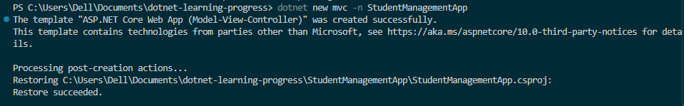
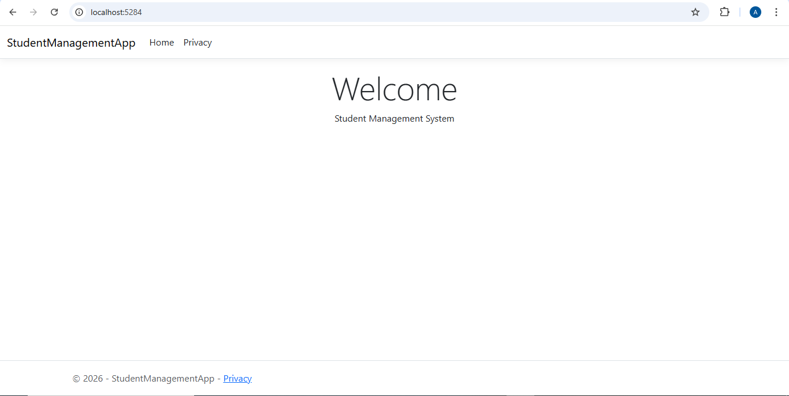
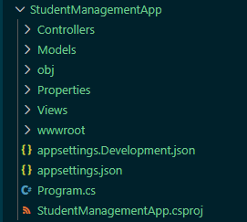

# Day 8 Progress
## Topics Covered
- .NET Core & ASP.NET Core
  - .NET Framework vs .NET Core
  - ASP.NET Core overview (MVC, Web API, Razor Pages, Blazor)
- Web Application Architecture
- Hosting
- .NET CLI
- ASP.NET Core Project Structure

## Tasks Completed
- **Created ASP.NET Core Web App using CLI**
  - Ran `dotnet new mvc -n StudentManagementApp` to create Student Management Web App
    

  - Ran `dotnet run` and verified app loads on local host
    

- **Explored Project Structure**
  - Understood role of each folder and file generated by the template
    
