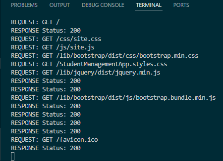
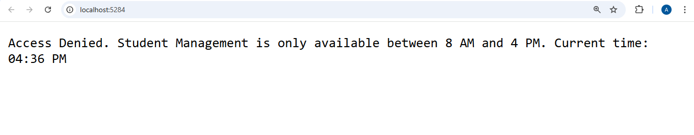
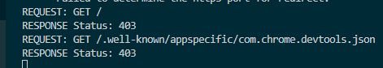

# Day 9 Progress
## Topics Covered
- Middleware & Request Pipeline
  - Run, Use, Map methods
  - Order of Middleware in the pipeline
  - HttpContext (Request, Response, Headers, StatusCode)
  - Built-in Middleware (UseStaticFiles, UseRouting, UseAuthorization, etc.)

- Custom Middleware
  - Inline middleware using app.Use() 
  - Class-based middleware 

## Tasks Completed
- **Implemented Request Logger Middleware**
  - Created `Middleware/RequestLoggerMiddleware.cs`
  - Logs every incoming request method & path and outgoing response status code to console
  
  

- **Implemented Office Hours Middleware**
  - Created `Middleware/OfficeHoursMiddleware.cs`
  - Blocks access to the app outside 8 AM – 4 PM with a 403 response
  
  

  
