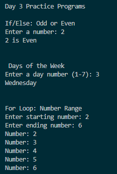
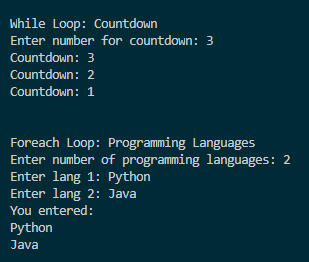

# Day 3 Progress

## Topics Covered
- Control Statements
  - If/Else
  - Switch
- Loops
  - For
  - While
  - Foreach
- Practiced logical programs

## Tasks Completed
- Implemented odd/even number checker using If/Else
- Used Switch statement for day of week example
- Practiced looping with For, While, and Foreach loops
- Created simple logical programs using loops and conditionals

## Output Screenshots

### Day 3 Console Programs

