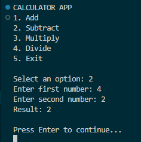
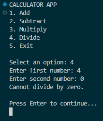
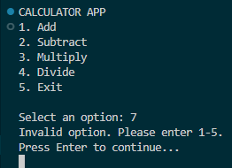

# Day 4 Progress

## Topics Covered
- Methods
- Exception Handling
- Built a CLI Calculator App

## Tasks Completed
- Created reusable methods for addition, subtraction, multiplication, and division
- Implemented input validation for numbers and menu options
- Used exception handling to manage divide-by-zero and invalid inputs
- Built a functional CLI calculator using loops, methods, and exception handling

## Output Screenshots

### Day 4 Calculator App

