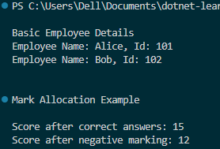

# Day 5 Progress

## Topics Covered
- Object-Oriented Programming (OOP)
  - Class 
  - Object 
  - Constructor
- Encapsulation

## Tasks Completed
- Created `Employee` class to practice **Class, Object, Constructor** (Employee class created, objects initialized via constructor, ShowDetails method used)
- Created `MarkAllocation` to practice **Encapsulation** (Exam class with private score field and public methods)

## Output Screenshot

