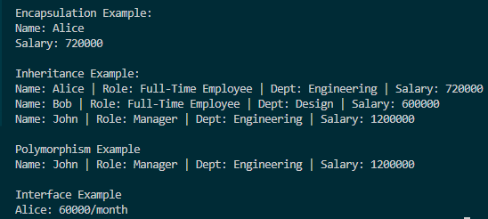

# Day 6 Progress

## Topics Covered
- Object-Oriented Programming (OOP)
  - Inheritance
  - Polymorphism
  - Interfaces
  - Abstract Classes
  - Method Overriding

## Tasks Completed
- **Implemented Mini Console OOP Project to Display Employee Details**
  - Created abstract `Employee` class to practice **Abstract Classes & Encapsulation**  
    (private fields `_name` and `_salary` with public/protected properties, abstract `GetRole` method)
  - Created `FullTimeEmployee` class to practice **Inheritance & Interface Implementation**  
    (`FullTimeEmployee` inherits `Employee` and implements `IPayable`)
  - Created `Manager` class to practice **Multi-level Inheritance & Polymorphism**  
    (overrides `GetRole` and `ShowInfo`)
  - Demonstrated **Polymorphism** by calling `ShowInfo` on `Employee` reference pointing to `Manager`
  - Demonstrated **Interface usage** by calling `GetMonthlySalary` on `IPayable` reference

## Output Screenshot

