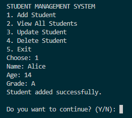
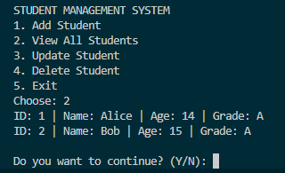
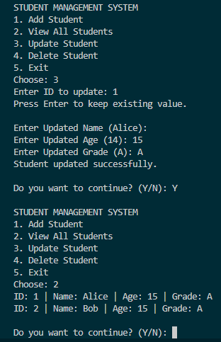
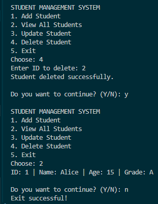

## Day 7 – Week 1 Assessment

### CLI-Based Student CRUD Console Application

- Built  **console-based Student Management System** 
- The application performs basic **CRUD operations** (Create, Read, Update, Delete) for managing student records through a menu-driven CLI interface.

### Features Implemented
- Add a new student
- View all students
- Update student details
- Delete a student record
- Exit the application

### Concepts Used
- Classes and Objects
- Constructors
- Methods
- Arrays for storing data
- Loops and Conditional Statements
- Console Input/Output

### Code
`code/StudentManagement.cs`

### Output Screenshots

**Add Student**

**View Student(s)**

**Update Student**

**Delete Student**
